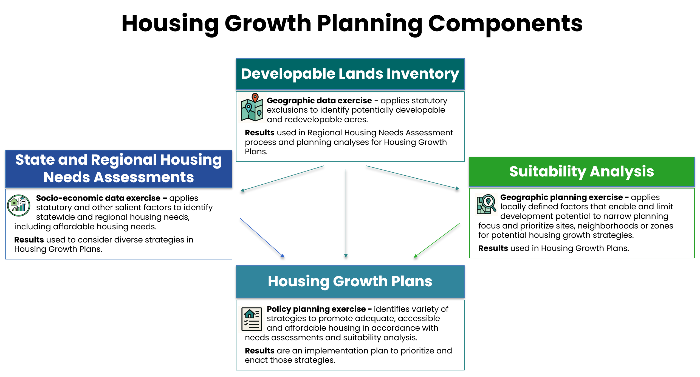

# Summary {.unnumbered}

The *Developable Land Inventory Technical Guidance*, prepared by the Connecticut Office of Policy and Management's GIS Office, provides a standardized, transparent framework for municipalities to identify a "developable land inventory", a preliminary screening level product, as defined in [Connecticut General Statutes (C.G.S.) Sec. 8-13aa](https://cga.ct.gov/2026/sup/chap_124b.htm#sec_8-13aa). This is required as part of the Regional Housing Needs Assessment allocation requirements ([C.G.S. Sec. 8-13dd](https://cga.ct.gov/2026/sup/chap_124b.htm#sec_8-13dd)) and the municipal and regional Housing Growth Plans ([C.G.S. Sec. 8-13bb and 8-13cc](https://cga.ct.gov/2026/sup/chap_124b.htm#sec_8-13bb)), as well as a foundational piece of subsequent suitability analyses as part of the a Housing Growth Plan. The guidance outlines datasets, analytical methods, and mapping standards that can be used to produce a consistent, statewide inventory of developable land.

The document emphasizes that identifying land as “developable” does not obligate development, nor does exclusion from the inventory permanently restrict future development opportunities. Instead, the inventory serves as a foundational input to each municipality’s Housing Growth Plan, supporting other elements of the planning process. The developable land inventory is not a permanent designation of a property's development potential.

The developable land inventory is only one element of the broader planning process required under these statutes. The diagram below shows how it fits within that larger analysis.

{fig-align="center"}

 

## [Use of This Analysis](outputs.qmd)

In the **Regional Housing Needs Assessment**, the following should be included:

- A summary of developable land pursuant to Section 8‑13aa for use in the Regional Housing Needs allocation.

In the subsequent **suitability analyses** of a Housing Growth Plan:

- The developable land inventory serves as a foundation, with locally selected planning factors added to identify areas that could potentially enable or limit development.

As an element of a **Housing Growth Plan**, the following should be included:

- Three town-wide maps showing statutory exclusions, developable land, vacant parcels, and potential redevelopment areas.

- A narrative methodology describing data sources, queries, processing steps, and classification methods used in the analysis.

 

## [Statutory Definitions](stat_def)

[C.G.S. Sec. 8-13aa](https://cga.ct.gov/2026/sup/chap_124b.htm#sec_8-13aa) defines what "developable land" is within the context of this planning exercise. In addition to areas that are commercially feasible for development, it outlines five categories of land that should be excluded from the developable land inventory:

A.  Land already committed to public use or purpose (public or private)
B.  Open space, parks, and recreation areas dedicated to the public or protected by a conservation easement
C.  Land subject to enforceable restrictions or prohibitions on development
D.  Wetlands or watercourses, as defined in the Wetlands and Watercourses Act (CGS Chapter 440)
E.  Contiguous land areas of 0.5 acres or more that are unsuitable for development due to steep slopes or other topographic conditions

For each category, the guidance identifies recommended datasets and provides detailed instructions for filtering, querying, and validating features.

 

## [Vacant and Redevelopable Land](vac_redev.qmd)

Beyond statutory exclusions, municipalities are encouraged to identify:

- Vacant parcels

- Potentially redevelopable parcels

These categories can help identify 'commercially feasible' opportunities, support later phases of the Housing Growth Plan process, and inform future housing capacity assessments.

 

## [Mapping Standards](map.qmd)

The guidance specifies three maps to be included in the Housing Growth Plans:

1.  Statutory Exclusions Map

2.  Developable Land Map

3.  Developable Land Summary Map, including vacant and redevelopment-potential parcels

 

## [Next Steps](end.qmd)

The Developable Land Inventory is just one portion of the Housing Growth Planning process. While this is a required element in the Housing Growth Plans and the Regional Needs Assessments, separate analyses will apply locally defined factors that enable and limit development potential to narrow planning focus and prioritize site, neighborhoods, or zones for potential housing growth strategies.